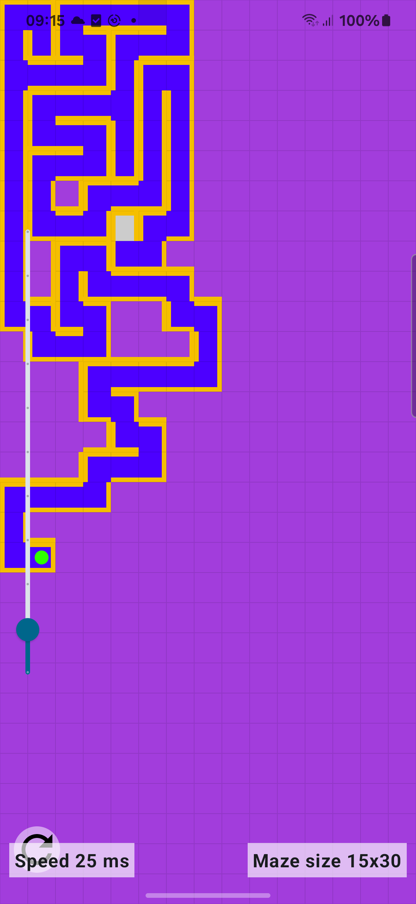

# MazeGen

A simple Android App generating a maze using only Jetpack Compose.

This is based on a iterative algorithm with a back stack:
https://en.wikipedia.org/wiki/Maze_generation_algorithm#Iterative_implementation_(with_stack)

